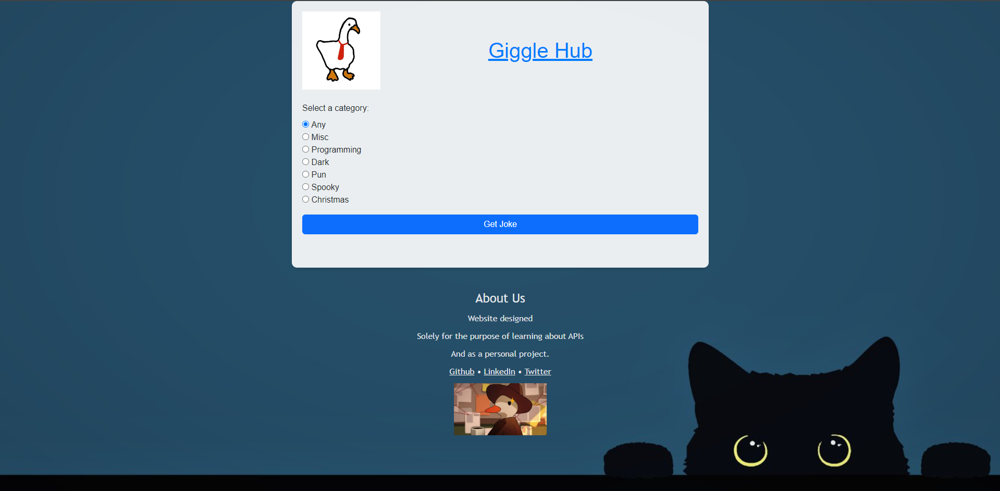

# Giggle Hub

Giggle Hub is your go-to destination for jokes and laughter! Explore a wide range of hilarious jokes across various categories and brighten up your day with a good laugh.

## 

## Features

- **Category Selection**: Browse through different joke categories such as Programming, Miscellaneous, Pun, and more.
- This web application utilizes the **Joke API** to provide a wide range of hilarious jokes across various categories.
- **Random Joke Generation**: Simply select your preferred category and click a button to get a random joke.
- **User-Friendly Interface**: Enjoy a simple and clean interface designed for effortless navigation and enjoyment.

## Technologies Used

- HTML5
- CSS3 (Bootstrap)
- JavaScript (Bootstrap and Fetch API)

## Getting Started

To get started with Giggle Hub, simply clone this repository to your local machine and open the `index.html` file in your web browser.

## Usage
- Open index.html in your web browser.
- Select a joke category from the dropdown menu.
- Click the "Get Joke" button to display a random joke from the selected category.

## Contributing

Contributions are welcome! If you would like to contribute to Giggle Hub, please follow these steps:

Fork the repository.
- Create a new branch (git checkout -b feature/new-feature).
- Make your changes.
- Commit your changes (git commit -am 'Add new feature').
- Push to the branch (git push origin feature/new-feature).
- Create a new Pull Request.
- Please ensure that your contributions adhere to the project's coding standards and guidelines.

```bash
git clone https://github.com/DSCmatter/giggle-hub.git
cd giggle-hub
````
## License

This project is licensed under the MIT License - see the [LICENSE](LICENSE) file for details.

## Acknowledgements
Special thanks to JokeAPI v2 By Sven Fehler to make this project possible.


